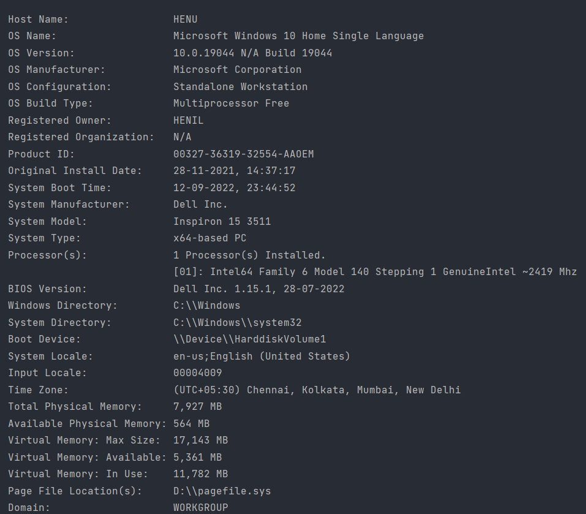
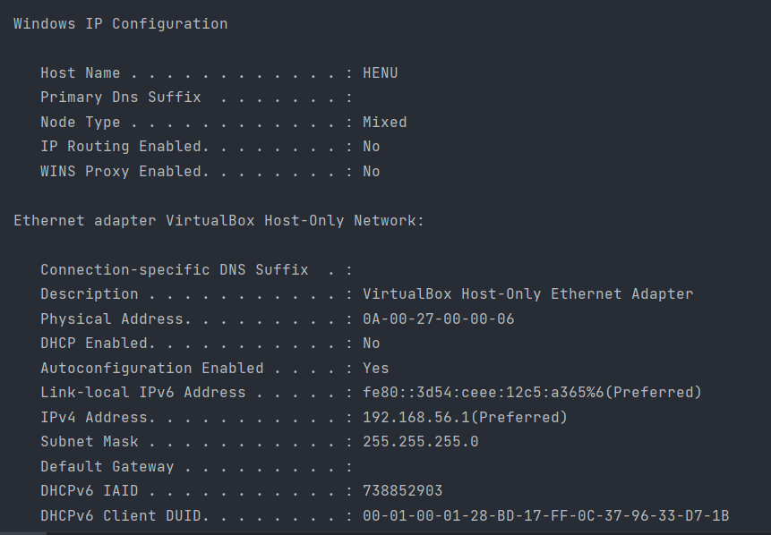
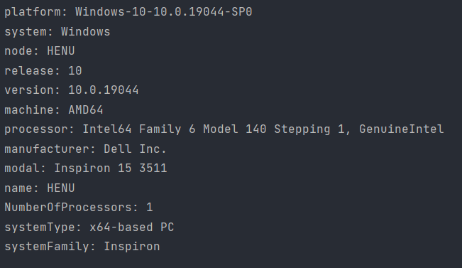

# pymachine

Pymachine is a python library that gives the information about user sytem and other information about system such as
- ###Anti viruses information
  - how many are installed?
  - which are installed?
  - Helpful website to convert and efficiently see Text to JSON fomate
    - `https://jsonformatter.curiousconcept.com/`
  
- ###Full system information
  - os name
  - os version
  - os build type
  - system model
  - etc.
  
- ###Network information
  - ip configuration
  - NIC information and configuration
  - etc.
  
- ###System Information
  - model
  - version
  - processor
  - system type (x64,x32)
  
